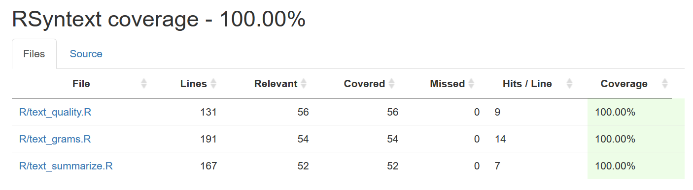

# RSyntext


Text Summarization in R


## Contributors

|Name | Github |
|---|---|
| Harjyot Kaur |[harjyotkaur](https://github.com/HarjyotKaur)  |
| Alexander Pak | [pak-alex](https://github.com/pak-alex) |
| Yenan Zhang |[YenanZ](https://github.com/YenanZ)  |


## Successful Travis build

[](https://travis-ci.org/UBC-MDS/RSyntext)

Please see the succesful build under Build History

### Summary

There are many packages that cover summary statistics for numerical data. However, when it comes to text data, there is a lack of selection for packages of similar functionality. Our group would like to tackle this problem by creating `RSyntext`.  This package will allow users to input passages and receive summary information and quality analysis of the text, giving the user valuable information on how best to proceed with their data.

Sample functionality included in this package for a given text passage:

* Most common word
* Average word length
* Most frequent n-gram
* Toxicity in text
* Number of spelling mistakes
* ...etc.

## Usage Scenario

#### Installation

 * Open RStudio and in the console type

 `devtools::install_github("ubc-mds/RSyntext")`

*Note: Make sure packages such as "Rcpp" and "slam" are installed with the latest versions, else it might cause issues with downloading RSyntext.*


### Function 1: `text_summarize`

`text_summarize` function of class `RSyntext` takes in `character` string as an input and produces `data.frame` as an output containing a quantitative summary of the input. The quantitative summary entails the following:

- Number of Words
- Number of Sentences
- Most Common Word/Words
- Least Common Word/Words
- Average Word Length
- Average Sentence Length

<br>

| Name | Type |
|---|---|
| Input | character |
| Output | data.frame |

<br>

The function takes in the following arguments:

<br>

| Name | Type | Default|
|---|---|---|
| txt | character | NA |  
| stop_remove | boolean | False |
| remove_punctuation | boolean | True |
| remove_number |  boolean | True |
| case_sensitive |  boolean | False |

<br>

#### Usage:

```
library (RSyntext)

txt <- "This is the first sentence in this paragraph. This is the second sentence. This is the third."

text_summarize(txt)

```

Output
-------

|word_count|sentence_count|most_common|least_common|avg_word_len|avg_sentence_len|
|---|---|---|---|---|---|
|17|3|this|first, in, paragraph, second, third|4.352941|29.333333|

<br>

### Function 2: `text_grams`

`text_grams` function of class `RSyntext` takes in `character` string as an input and produces `data.frame` as an output containing lists of top 5 ngrams. The top `k` ngrams and `n` are user based inputs with default values (k=5 and n=(2,3))

<br>

| Name | Type |
|---|---|
| Input | character |
| Output | data.frame |

<br>

The function takes in the following arguments:
<br>

| Name | Type | Default|
|---|---|---|
| text | character | NA |
| k | int | 5 |
| n | int,list | (2,3) |
| stop_remove | boolean | True |
| remove_punctuation | boolean | True |
| remove_number |  boolean | True |
| case_sensitive |  boolean | False |

<br>

#### Usage:

```
library (RSyntext)

txt <- "Repeat repeat repeat this that this that this that should produce should produce bigrams."

text_grams(txt, n=c(2,3), k = 2)

```


Output
-------

|2gram|Number of Instances|3gram|Number of Instances|
|---|---|---|---|
|repeat repeat|2|produce produce bigrams|1|
|produce bigrams|1|repeat produce produce|1|


<br>

### Function 3: `text_quality`

`text_quality` function of class `RSyntext` takes in `character` string as an input and produces `data.frame` as an output a qualitative summary of the input. The qualitative summary would include the following:

- Spelling Mistakes: List of words spelt wrong
- Count of words spelt wrong: Count of words spelt wrong
- Proportion of words spelt wrong: Words spelt wrong /Total words
- Toxic Words: List of Abusive or Slang words used
- Count of toxic words: Count of toxic words
- Proportion of toxic words: Count of toxic words /Total words
<br>

| Name | Type |
|---|---|
| Input | character |
| Output | data.frame |

<br>

The function takes in the following arguments:
<br>

| Name | Type | Default|
|---|---|---|
| txt | character | NA |

<br>

<br>

#### Usage:

```
library(RSyntext)

txt <- "This is the wrng. This is shitty."

text_quality(txt)

```

Output
-------

|spell_error|count_spell_error|proportion_spell_error|toxic_words|count_toxic_words|proportion_toxic_words|
|---|---|---|---|---|---|
|wrng|1|0.142857|shitty|1|0.142857|

## Test Coverage



## Dependencies

* stringr
* tm
